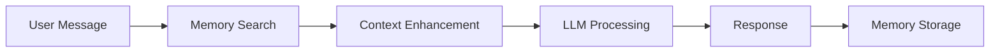

# SharedLM 🤖

<div align="center">


[](https://shared-lm.vercel.app)
[](https://sharedlm.onrender.com)
[](LICENSE)
[](http://makeapullrequest.com)

### Tech Stack


### AI Models


### Status


</div>

---

<div align="center">
  <h3>A unified chat interface that enables seamless conversations across multiple LLMs with persistent shared memory</h3>
  <p>Built with a distinctive monochromatic design system featuring LED-style typography</p>
</div>

---

## ✨ Features

<table>
<tr>
<td>

### 🧠 Unified Memory System
- **Cross-Model Memory**: Conversations persist across different AI models using Mem0
- **Context Awareness**: Each AI model can access and build upon previous conversations
- **Smart Retrieval**: Automatic context retrieval based on conversation relevance

</td>
<td>

### 🎨 Minimalist Design
- **Monochromatic UI**: Clean black, white, and gray aesthetic
- **LED Typography**: Distinctive dot-matrix style typography
- **Glyph Elements**: Minimalist design with red accent indicators
- **Smooth Animations**: Fluid transitions and micro-interactions

</td>
</tr>
</table>

### 🔌 Multi-LLM Support


## 🚀 Live Demo

<div align="center">

[](https://shared-lm.vercel.app)
[](https://sharedlm.onrender.com/docs)

</div>

## 🛠️ Technology Stack

<div align="center">

### Frontend


### Backend


### AI & Memory


</div>

## 📦 Installation

### Prerequisites


### Required API Keys

[](https://platform.openai.com/api-keys)
[](https://console.anthropic.com/)
[](https://app.mem0.ai/)

### Frontend Setup

```bash
# Clone the repository
git clone https://github.com/yourusername/sharedlm.git
cd sharedlm/frontend

# Install dependencies
npm install

# Create environment file
cp .env.example .env.local

# Add your environment variables
# REACT_APP_API_URL=http://localhost:8000 (for development)
# REACT_APP_API_URL=https://sharedlm.onrender.com (for production)

# Start development server
npm start
```


### Backend Setup

```bash
# Navigate to backend directory
cd sharedlm/backend

# Create virtual environment
python -m venv venv
source venv/bin/activate  # On Windows: venv\Scripts\activate

# Install dependencies
pip install -r requirements.txt

# Create .env file
cat > .env << EOL
MEM0_API_KEY=your_mem0_api_key
OPENAI_API_KEY=your_openai_api_key
ANTHROPIC_API_KEY=your_anthropic_api_key
DEFAULT_MODEL_OPENAI=gpt-4o-mini
DEFAULT_MODEL_ANTHROPIC=claude-3-haiku-20240307
DEFAULT_TOP_K=5
EOL

# Run the server
uvicorn app:app --reload --host 0.0.0.0 --port 8000
```


## 🚢 Deployment

### Deploy Frontend to Vercel

[](https://vercel.com/new)

```bash
# Install Vercel CLI
npm i -g vercel

# Deploy
vercel

# Set environment variables in Vercel dashboard
# REACT_APP_API_URL = https://your-backend-url.onrender.com
```

### Deploy Backend to Render

[](https://render.com)

1. Create a new Web Service on [Render](https://render.com)
2. Connect your GitHub repository
3. Configure build settings:
   - **Build Command**: `pip install -r requirements.txt`
   - **Start Command**: `python3 -m uvicorn app:app --host 0.0.0.0 --port $PORT`
4. Add environment variables

## 📡 API Endpoints

<div align="center">


</div>

### Core Endpoints

| Method | Endpoint | Description | Status |
|--------|----------|-------------|--------|
|  | `/health` | Health check |  |
|  | `/models` | Get available models |  |
|  | `/chat` | Send message and get response |  |
|  | `/memory/search` | Search user memories |  |
|  | `/memory/debug/{user_id}` | Debug user memories |  |

### Example Request

```json
{
  "user_id": "user_abc123",
  "message": "Tell me about quantum computing",
  "model_choice": "openai"
}
```

## 🎯 Architecture

<div align="center">



</div>

## 🎨 Design System

<div align="center">


</div>

### Color Palette


## 📱 Pages & Routes

| Route | Page | Description | Status |
|-------|------|-------------|--------|
| `/` | Redirect | Redirects to `/chat` |  |
| `/chat` | Chat Interface | Main conversation interface |  |
| `/integrations` | Multi LM | Connect and manage AI models |  |
| `/projects` | Projects | Organize conversations |  |
| `/history` | Chat History | View past conversations |  |
| `/analytics` | Analytics | Usage statistics and insights |  |
| `/settings` | Settings | Configure preferences |  |

## 🐛 Troubleshooting

<details>
<summary><b>Backend Connection Issues</b></summary>

```bash
# Check if backend is running
curl http://localhost:8000/health

# Check CORS settings in app.py
# Ensure your frontend URL is in allowed_origins
```
</details>

<details>
<summary><b>Memory Not Persisting</b></summary>

```bash
# Verify Mem0 API key
# Check /memory/debug/{user_id} endpoint
# Ensure user_id is consistent across sessions
```
</details>

<details>
<summary><b>Model API Errors</b></summary>

```bash
# Verify API keys are correctly set
# Check API rate limits
# Ensure model names are correct in config
```
</details>

## 🤝 Contributing


1. Fork the repository
2. Create your feature branch (`git checkout -b feature/AmazingFeature`)
3. Commit your changes (`git commit -m 'Add some AmazingFeature'`)
4. Push to the branch (`git push origin feature/AmazingFeature`)
5. Open a Pull Request

## 📊 Project Stats


## 📄 License


This project is licensed under the MIT License - see the [LICENSE](LICENSE) file for details.

## 🙏 Acknowledgments

- **Design Philosophy**: Minimalist monochromatic interface design
- **Memory System**: [Mem0](https://mem0.ai/) for persistent memory
- **LLM Providers**: [OpenAI](https://openai.com/) and [Anthropic](https://anthropic.com/)
- **Deployment**: [Vercel](https://vercel.com/) and [Render](https://render.com/)

## 📞 Contact & Support

<div align="center">

[](https://github.com/yourusername)
[](mailto:your-email@example.com)
[](https://twitter.com/yourhandle)
[](https://discord.gg/yourserver)

</div>

## 🚀 Roadmap


- [ ]  Add support for more LLMs (Llama, Mistral, Gemini)
- [ ]  Implement voice input/output
- [ ]  Add collaborative chat rooms
- [ ]  Enhanced analytics dashboard
- [ ]  Mobile app (React Native)
- [ ]  Export conversations in multiple formats
- [ ]  Custom model fine-tuning support

---

<div align="center">

### Built with ❤️ using


<br>

[](https://github.com/yourusername/sharedlm)

</div>
