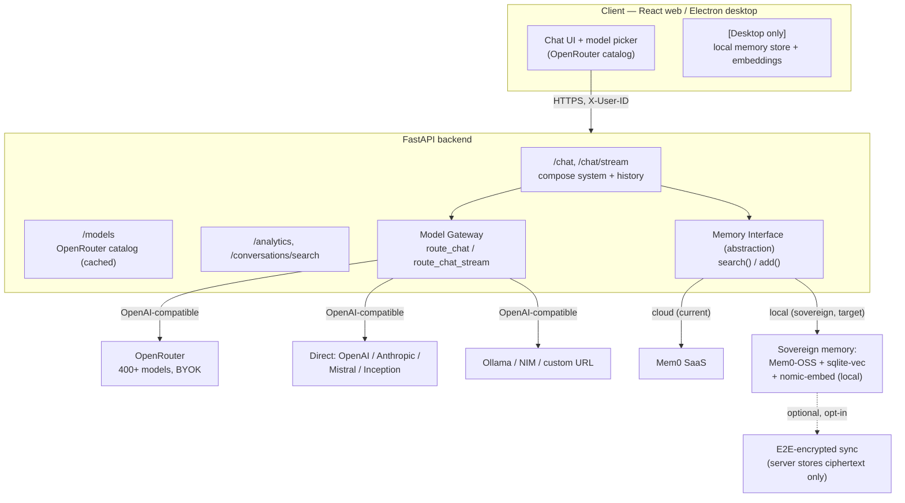

# SharedLM — Tentative v1 Architecture (Pivot)

> **Status: TENTATIVE / WORKING DRAFT — June 2026.**
> This captures the direction we're pivoting toward. Some pieces are decided and
> being built; others are open and waiting on a call. Don't treat anything here
> as final until it's marked ✅ Decided.
>
> | Area | State |
> |---|---|
> | Model access via **OpenRouter gateway** | ✅ Decided — implementing now |
> | Memory moat = **local-first / sovereign** | ✅ Decided (direction) |
> | Memory engine = **Mem0 OSS + sqlite-vec + local embeddings** | 🟡 Proposed (default pick) |
> | Sync model | ✅ Decided — **local-first + E2E-encrypted sync** (user holds key; server stores ciphertext only) |
> | Extraction location (local model vs cloud chat model) | ❓ Open — leaning per-user toggle |
> | General vs vertical product focus | ❓ Open — user to decide |

---

## 1. The pivot in one paragraph

SharedLM was conceived (late 2025) as "one chat UI across providers with shared
Mem0 memory." In mid-2026 that framing is weak: the model vendors now import each
other's memory, and "multi-provider chat" is table stakes (LibreChat, Open WebUI,
Cherry Studio). The two changes that make the project defensible again:

1. **Stop adding providers one at a time.** Route through **OpenRouter** — one
   OpenAI-compatible endpoint to 400+ models — and offer **NVIDIA NIM** / **Ollama**
   for self-hosted. The hardcoded provider list and the "DeepSeek/Gemini/Llama
   coming soon" tiles go away.
2. **Make the moat the memory the user *owns*, not the memory *algorithm*.** The
   engine is commoditized (buy it). The defensible position the incumbents can't
   copy is **local-first, user-owned, model-agnostic memory** — because their
   business *is* holding your data. See `GAP_ANALYSIS.md` and the memory-moat
   research thread for the full reasoning.

The reframed pitch: **"Your portable, private AI memory — usable across every model."**

---

## 2. Strategic decisions captured

- **Model layer:** OpenRouter as the default gateway (BYOK supported), with direct
  providers and Ollama/NIM still available through the existing custom-integration
  mechanism. ✅
- **Memory moat:** sovereignty (own-your-data, local-first), *not* lock-in via a
  proprietary cloud store. The store and extraction stay on the user's device;
  SharedLM servers never hold plaintext memory. ✅ (direction)
- **What we explicitly do NOT build:** our own memory algorithm/engine from scratch.
  We adopt a best-in-class engine and own the *product* layer (ownership, UX,
  cross-model breadth). ✅

---

## 3. v1 architecture



ASCII fallback:

```
Client (web / Electron) ──HTTPS(X-User-ID)──> FastAPI backend
  chat UI, model picker                         /chat /chat/stream  ──┐
  [desktop] local memory                        /models (OR catalog)  │
                                                 /analytics /search    │
                                          ┌──────────────┴───────────┐ │
                                          │ Model Gateway            │ │
                                          │  route_chat[_stream]     │ │
                                          │   → OpenRouter (400+)    │ │
                                          │   → direct OpenAI/...     │ │
                                          │   → Ollama / NIM / custom │ │
                                          └──────────────────────────┘ │
                                          ┌────────────────────────────▼┐
                                          │ Memory Interface (abstract)  │
                                          │  search() / add()            │
                                          │   ├─ Cloud: Mem0 SaaS (now)   │
                                          │   └─ Local: Mem0-OSS +        │
                                          │       sqlite-vec + nomic-embed│
                                          │       (+ opt E2E sync)        │
                                          └──────────────────────────────┘
```

---

## 4. Component breakdown

### 4a. Model Gateway — OpenRouter (implementing now)

- OpenRouter is OpenAI-compatible: `base_url=https://openrouter.ai/api/v1`, standard
  chat-completions + streaming. Model ids look like `openai/gpt-4o`,
  `anthropic/claude-sonnet-4`, `google/gemini-2.5-flash`, etc.
- **Reuses existing patterns:** `provider = "openrouter"`, per-user API key stored
  exactly like other providers (Fernet-encrypted), streaming via the existing
  `_stream_openai_compatible` helper with the OpenRouter base URL.
- **Live catalog:** a cached `/models` (or `/openrouter/models`) endpoint proxies
  `GET https://openrouter.ai/api/v1/models` so the UI lists the real 400+ catalog
  instead of the hardcoded `defaultModelVariants` map.
- **Attribution headers:** send `HTTP-Referer` + `X-Title` (OpenRouter convention).
- NIM / Ollama / any OpenAI-compatible server continue to work through the existing
  custom-integration path; no special-casing needed.

### 4b. Memory Interface (abstraction — small refactor)

Today `apps/server/services/mem0_client.py` is called directly from the chat route
(`search_memories` before reply, `add_memory` after, in the background). We wrap it
behind a thin interface so the engine is swappable:

```
MemoryBackend (protocol)
  search(user_id, query, limit) -> list[str]
  add(user_id, messages, project_id) -> None
  ── Mem0CloudBackend   (current behavior, default for web)
  ── Mem0LocalBackend   (sovereign: Mem0-OSS + sqlite-vec + local embeddings)
```

The chat flow I already refactored (`_prepare_chat` → system context + history)
calls the interface, not a concrete client. Swapping backends becomes a config
choice, not a code change in the hot path.

### 4c. Sovereign memory layer (design — awaiting decision)

| Concern | Choice |
|---|---|
| Orchestration | **Mem0 OSS**, configured no-cloud |
| Vector store | **sqlite-vec** (reuses existing SQLite) — LanceDB if we outgrow it |
| Embeddings | **nomic-embed-text** (768-dim, 274MB) or all-MiniLM (384-dim, 46MB), CPU |
| Extraction | local model (air-gapped) **or** the cloud chat model (lighter) — ❓ open |
| Multi-device | optional **E2E-encrypted sync**, user holds key, server = ciphertext — ❓ open |

**Sovereignty boundary (be honest):** when chatting with a *cloud* model, relevant
memories are injected into that prompt, so the cloud model sees them transiently.
What sovereignty guarantees is that the **persistent store + extraction stay
on-device and our servers never hold the memory.** Full air-gap = user also runs a
local (Ollama) chat model, which the stack already supports.

---

## 5. Storage footprint (why "local burden" is a non-issue)

Memory is **distilled** (salient facts, not raw transcripts), so per-user size stays
tiny over years:

- Raw chat text: ~50 msgs/day × 365 × ~1KB ≈ **18 MB/year** (and already stored in
  SQLite separately from memory).
- Embeddings drive size: nomic-embed (768-dim) ≈ 3KB/vector →
  **50,000 distilled memories ≈ 150 MB**; all-MiniLM (384-dim) ≈ 75 MB; int8-quantized
  ≈ 38 MB; binary-quantized ≈ 5 MB.
- Embedding model on disk: one-time 46–274 MB.

Bounded by three mechanisms: **distillation**, **forgetting/decay** (a designed
feature that also improves quality), and **quantization** (4–32× shrink on demand).

**The real constraints are compute (on-device extraction), cross-device sync, and
that the web client can't be sovereign — not disk space.**

---

## 6. Open decisions (owner: user)

1. **Sync model** — local-only (simplest, single-device, max sovereignty) vs
   local-first + opt-in E2E-encrypted sync (multi-device, more work).
   *Lean: build local-only first; design the store so sync can be added without migration.*
2. **Extraction location** — local model (true air-gap, more compute) vs cloud chat
   model does extraction (lighter, sees text anyway). *Lean: per-user toggle tied to
   local-vs-cloud chat model.*
3. **General vs vertical** — a target user segment would sharpen the memory schema
   and the whole pitch.

---

## 7. Phasing

1. **OpenRouter gateway** (backend) — in progress. Collapses provider list into a
   live 400+ catalog; keeps BYOK.
2. **Memory interface abstraction** — wrap `mem0_client` so backends are swappable.
3. **Sovereign memory backend** — Mem0-OSS + sqlite-vec + local embeddings (after
   decisions in §6).
4. **(Optional) E2E sync** + **MCP memory server** (expose the user's memory to other
   clients) — the portability layer, if we go that way.
5. **Frontend** — streaming, stop/regenerate/copy, multi-line, voice, export,
   analytics + search wiring, OpenRouter model picker. (Built on the new backend.)

---

## 8. Sources / research trail

- OpenRouter (400+ models, BYOK, OpenAI-compatible): https://tokenmix.ai/blog/openrouter-api
- NVIDIA NIM (free hosted tier, OpenAI-compatible): https://lilting.ch/en/articles/nvidia-nim-free-inference-100-models-openai-compatible
- Memory engine comparison + LongMemEval: https://mem0.ai/blog/state-of-ai-agent-memory-2026
- Mem0 fully-local (Ollama + local vector store): https://docs.mem0.ai/cookbooks/companions/local-companion-ollama
- Graphiti temporal KG (deferred for v1): https://neo4j.com/blog/developer/graphiti-knowledge-graph-memory/
- Embedded vector stores (LanceDB / sqlite-vec): https://encore.dev/articles/best-vector-databases
- Local embedding models (nomic-embed sizes): https://www.morphllm.com/ollama-embedding-models
- E2E-encrypted sync pattern: https://www.newsoftwares.net/blog/end-to-end-encrypted-sync-vs-encrypted-at-rest-cloud/
- Portable-memory critique ("wallet fallacy"): https://blog.getzep.com/the-ai-memory-wallet-fallacy/
- Memory as moat / network effects: https://arxiv.org/pdf/2508.05867
